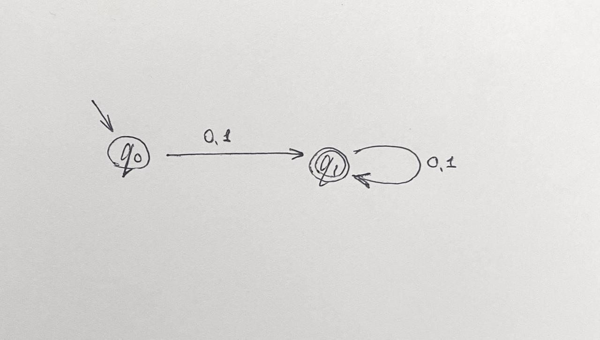
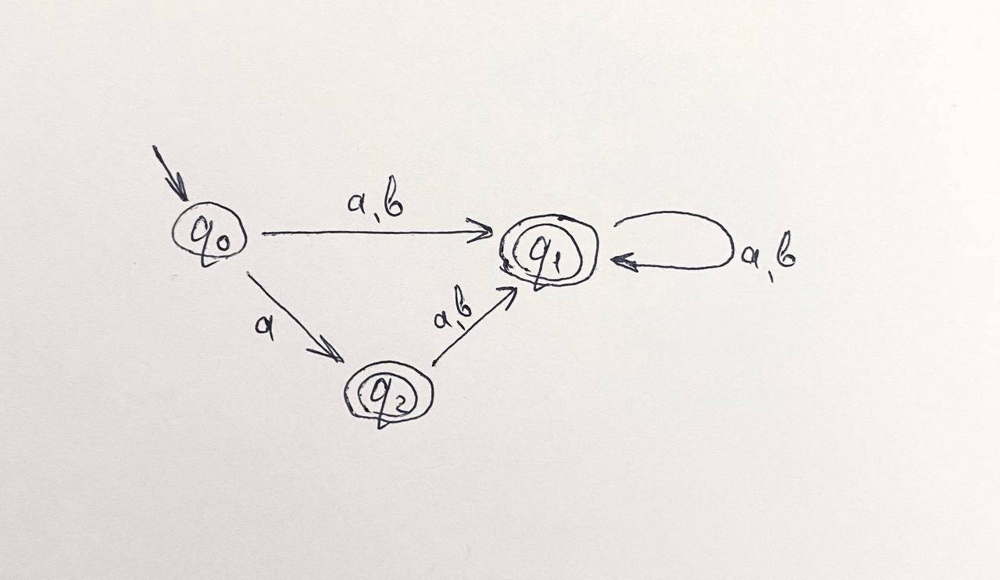
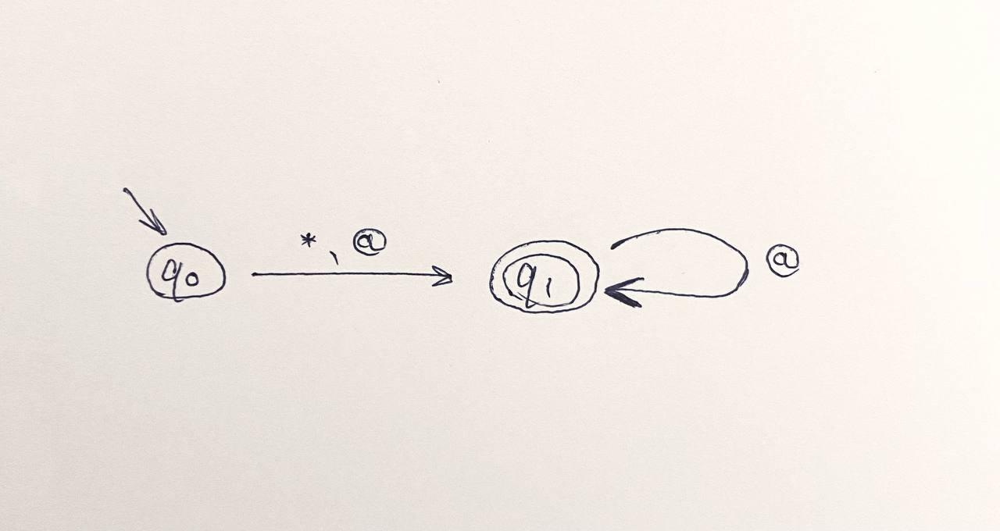

# Задание 0.    
Описание автомата:  
(Примеры можно найти во 2-3 задании)  
* Общие правила:
  + все числа оборачиваются в (..)
  + ключевые слова языка: alphabet, Q (количество состояний), start (начальное состояние), T (терминальные состояния), function (ребра с функцией перехода на них)
* Перечисляем алфавит языка автомата. Под капотом строим биекцию символов алфавита с натуральными числами. Например, если язык автомата {a,b}, то a -> 1, b -> 2. Далее 2 разделительных символа '||'.
* Номер вершины - стартового состояния
* Номера вершин - терминальных состояний
* Количество ребер, далее описание всех ребер автомата по принципу: (номер состояния - начала ребра)(номер состояния - конца ребра)(описание функции перехода по этому ребру). Описание функции перехода по ребру: мы строим биекцию между алфавитом языка автомата и натуральными числами и просто кодируем числами все символы языка автомата, по которым можно сделать переход в данном месте. Описание каждого ребра заканчивается символом "."  


# Задание 1.
TODO

# Задание 2 и 3.
Искать в файлике `main.py`  
Запускать: `python main.py "input.txt"`  
Тесты:  
1)   
Ввод: `alphabet:01 ||Q:(2) start:(0) T:(1) function:(0)(1)(1)(2).(1)(1)(1)(2).`  
Вывод:  
```
Analyzing the machine...
Alphabet:
0 1 
Vertex count:
2
Start state: 
0
Terminal states: 
1 
Edges: 
transition from 0 to 1 by "01"
transition from 1 to 1 by "01"

Testing the machine...
PASSED: Alphabet elements are unique
RASSED: Initial state is the only one
PASSED: States are unique
PASSED: machine is deterministic
PASSED: machine is complete
Well done!

```  
2)   
Ввод: `alphabet:ab ||Q:(3) start:(0) T:(2)(1) function:(0)(1)(1)(2).(0)(2)(1).(2)(1)(1)(2).(1)(1)(1)(2).`  
Вывод:  
```
Analyzing the machine...
Alphabet:
a b 
Vertex count:
3
Start state: 
0
Terminal states: 
2 1 
Edges: 
transition from 0 to 1 by "ab"
transition from 0 to 2 by "a"
transition from 2 to 1 by "ab"
transition from 1 to 1 by "ab"

Testing the machine...
PASSED: Alphabet elements are unique
RASSED: Initial state is the only one
PASSED: States are unique
NOT PASSED: machine is not determenistic
PASSED: machine is complete

```  
3)   
Ввод: `alphabet:*@ ||Q:(2) start:(0) T:(1) function:(0)(1)(1)(2).(1)(1)(2).`  
Вывод:  
```
Analyzing the machine...
Alphabet:
* @ 
Vertex count:
2
Start state: 
0
Terminal states: 
1 
Edges: 
transition from 0 to 1 by "*@"
transition from 1 to 1 by "@"

Testing the machine...
PASSED: Alphabet elements are unique
RASSED: Initial state is the only one
PASSED: States are unique
PASSED: machine is deterministic
NOT PASSED: machine is not complete

```


